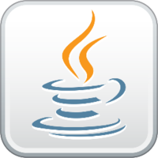

**Documentação** para *estudo* de ***Markdown***


# Título do Projeto
## Subtítulo
### **documentação**

Nova caixa de texto

* primeiro
    * primeiro.primeiro
    * primeiro.segundo

1. Linguagens de Script
    * 1.1 Javascript
    * 1.2 Actionscript
    * 1.3 VBScript

2. Sistemas Operacionais
    * 2.1 Microsoft Windows
    * 2.2 Linux
    * 2.3 MacOS

### código de um arquivo Java

``` javascript
    var nome = "Vinicius"
    nome = prompt("Digite seu nome");
    if(nome == ""){
        alert("Mensagem");
    }
```

### código de um arquivo C++

``` c++
    #include <iostream>
    using std::cout;
    using std::cin;
    using std::endl;

    int main(){
        cout << "Olá. Sejá Bem-Vindo" >> endl;
        return 0;
    }
```

## Imagens


### Tarefas

- [X] Montar o computador
- [X] Formatar o computador
- [X] Preparar o pendrive de boot
- [] Instalar o Sistema Operacional no computador
- [] Verificar instalação dos drivers

### Sistemas e Empresas

Empresas |  Sistemas  | Versão
---------|------------|-------
Microsoft| Windows    | 11
Apple    | MacOS      | 10.14
Ubunto   | Focal      | 2004
RedHat   | Enterprise | 8

### Aplicação e Dados

JQuerry|Python|Nodejs|React
-------|------|------|-----
|||
Java | MySQL | PostgreSQL | MongoDB
|||

### Site de consulta: 
* Alura - Criando anotações com Markdown: https://www.alura.com.br/artigos/criando-anotacoes-com-markdown